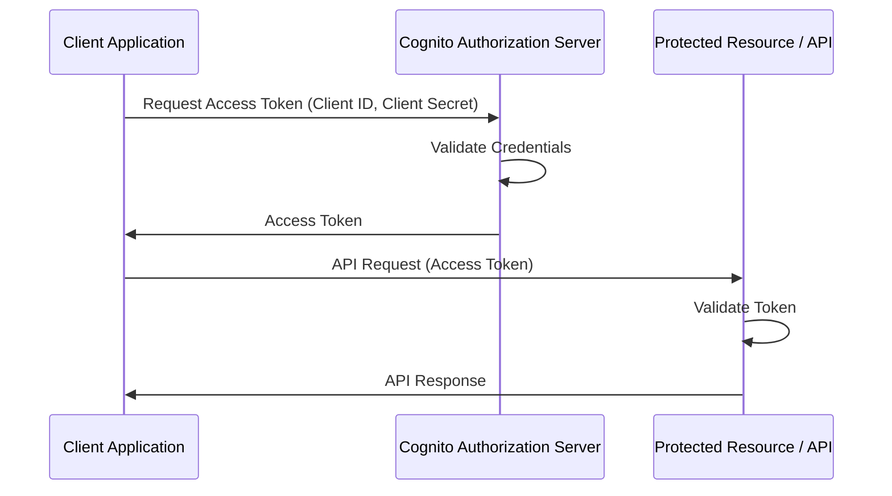

# trade-tariff-fpo-developer-hub

Express app giving FPO operators the ability to manage their own API credentials.

## Authentication

When this backend app is deployed to ECS we enable client credentials authentication using Cognito User Pools

Access tokens need to be refreshed by the client and the backend decodes/verifies the JWT in the Authorisation header.

## Point in time recovery

When restoring from a PITR snapshot a new table will be generated with the data in it. Change the value of the env var in
main.tf to update this to the new table name for all environments (e.g. development, staging and production) as this application is released.

See [pitr-manual] for how-to instructions on restoring from a Point in Time Recovery snapshot.

## API Documentation

Once the application is running, open a web browser and navigate to the Swagger UI URL: <http://localhost:5001/api-docs>

This has been disabled to only run in development mode as the endpoints are designed to be be internal.

[pitr-manual]: https://docs.trade-tariff.service.gov.uk/manual/how-to-backup-and-restore-in-aws-dynamodb-pitr.html
